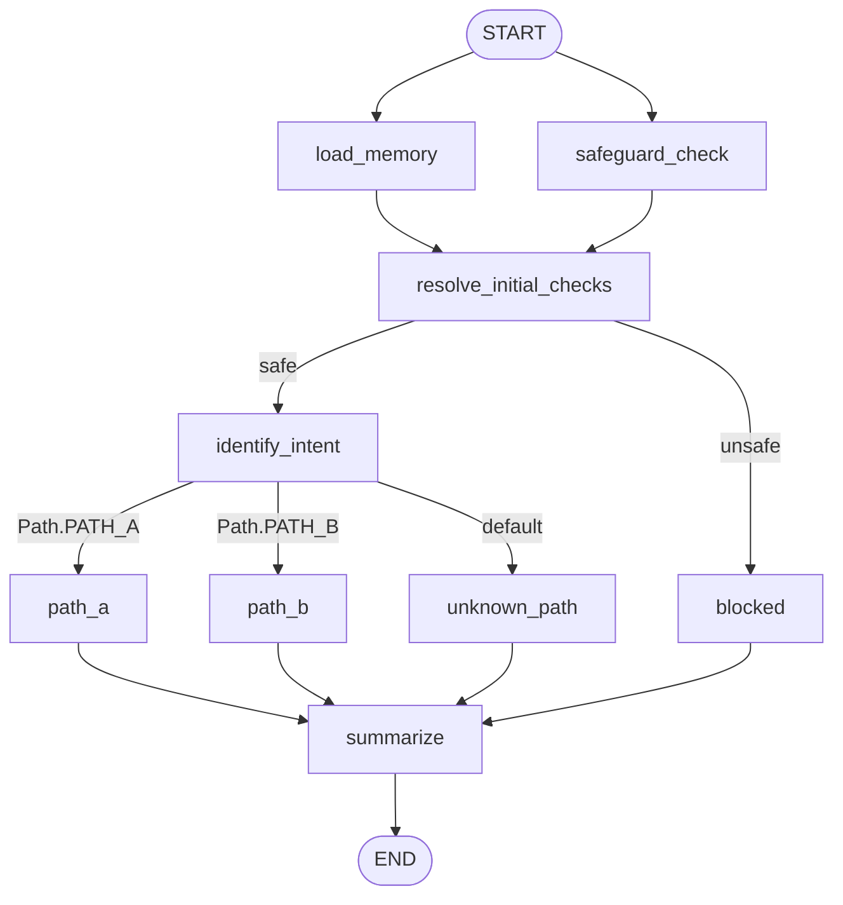

# LangGraph API

LangGraph API is a **template project** for building LangGraph-based applications with FastAPI.
Use it as a reference implementation to bootstrap new projects with graph orchestration, clean architecture boundaries, and persistent memory out of the box.

**What you get:**

- A reusable baseline for production-ready LangGraph services.
- Deterministic graph orchestration with intent-based routing.
- Persistent memory across interactions via database-backed state.

This repository is designed to be copied and adapted as a starting point for other LangGraph applications.

## Table of contents

- [What this project does](#what-this-project-does)
- [Prerequisites](#prerequisites)
- [Run the project (Uvicorn)](#run-the-project-uvicorn)
- [Run tests (Pytest)](#run-tests-pytest)
- [Hexagonal architecture (rough overview)](#hexagonal-architecture-rough-overview)
  - [Benefits](#benefits)
- [Graph structure (`src/application/graph/graph.py`)](#graph-structure-srcapplicationgraphgraphpy)

## What this project does

- Exposes HTTP endpoints with FastAPI (for example, `/chat` and `/health`).
- Routes each chat request through a graph-based flow (intent detection -> branch -> summarization).
- Persists conversation memory using PostgreSQL.

This project uses **LangGraph** to orchestrate stateful agent-like flows. Learn more at:
https://www.langchain.com/langgraph

## Prerequisites

- Python 3.12+
- Docker and Docker Compose
- A `.env` file (you can copy from `.env.example`)

Example:

```bash
cp .env.example .env
```

## Run the project (Uvicorn)

1. Start infrastructure first (PostgreSQL via Docker Compose):

```bash
docker compose up -d
```

2. Install dependencies (if you have not installed them yet):

```bash
python -m pip install -r requirements.txt
```

3. Start the API with Uvicorn:

```bash
uvicorn src.main:app --reload
```

4. Optional quick check:

```bash
curl http://127.0.0.1:8000/health
```

## Run tests (Pytest)

Even for tests, start Docker Compose first so PostgreSQL is available for integration-like flows:

```bash
docker compose up -d
```

Then run tests:
```bash
# quietly
pytest -q
```
or

```bash
# verbosely
pytest -vs
```

## Hexagonal architecture (rough overview)

This repository follows a **hexagonal architecture** (also known as ports-and-adapters):

- `src/domain`: core business concepts (the most stable center).
- `src/application`: use cases, orchestration, graph flow, and interfaces (ports).
- `src/adapters`: concrete implementations for external systems (HTTP API, model clients, persistence).

### Benefits

- Business rules stay isolated from framework/database/provider details.
- Swapping integrations is easier (for example, another model provider or storage backend).
- Code is easier to test because core logic depends on abstractions, not concrete tools.

## Graph structure (`src/application/graph/graph.py`)

The graph is defined with `StateGraph(State)` and has this flow:



1. `START` triggers both `load_memory` and `safeguard_check`.
2. Both nodes converge at `resolve_initial_checks`.
3. Conditional branch from `resolve_initial_checks`:
   - `safe -> identify_intent`
   - `unsafe -> blocked`
4. Conditional branch from `identify_intent`:
   - `path_a`
   - `path_b`
   - `unknown_path`
5. All terminal paths (`path_a`, `path_b`, `unknown_path`, `blocked`) converge to `summarize`.
6. `summarize -> END`

In practice, that means:

- Memory is loaded first.
- A safeguard check runs in parallel with memory loading.
- If blocked, the flow goes to `blocked` and then `summarize`.
- If safe, request intent selects a route.
- Route-specific behavior runs (`path_a`, `path_b`, or fallback `unknown_path`).
- A final summarization step produces the response.

The graph is compiled with a PostgreSQL-backed checkpointer/store (through the memory adapter), enabling state persistence across interactions.
