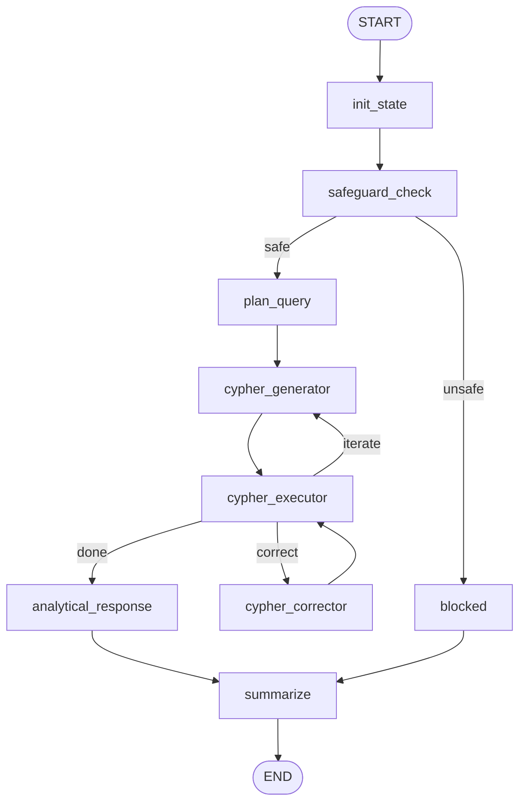

# Graph Query Service

## Table of contents

- [About the project](#about-the-project)
- [Architecture overview](#architecture-overview)
- [Prerequisites](#prerequisites)
- [Run the project (Uvicorn)](#run-the-project-uvicorn)
- [Run tests (Pytest)](#run-tests-pytest)
- [LangGraph structure (`src/application/graph/graph.py`)](#langgraph-structure-srcapplicationgraphgraphpy)

## About the project

Graph Query Service is a chat API that receives natural-language business questions and returns a consolidated analytical response.
Built with FastAPI and LangGraph, turns natural-language business questions into structured graph analysis. The flow detects user intent, decomposes complex requests into smaller steps when needed, generates and executes Cypher queries, consolidate the response. It also preserves conversation context so interactions remain stateful across requests.

At a high level, it:

- Understands user intent from each prompt.
- Breaks complex requests into smaller sub-questions.
- Translates each step into Cypher queries.
- Executes queries against the graph database.
- Aggregates results and returns an analytical response.
- Persists chat memory across interactions.

## Architecture overview

The project follows a hexagonal architecture (ports and adapters):

- `src/domain`: core business models and value objects.
- `src/application`: use cases, orchestration, graph state, and ports.
- `src/adapters`: concrete inbound/outbound implementations (API, model client, persistence).

```mermaid
flowchart LR
    Client[Client / HTTP] --> Inbound[Inbound Adapter\nFastAPI Router]

    subgraph AppHex[Application Layer (Hexagonal Boundary)]
        App[Application Services\nLangGraph Orchestration]
        Domain[Domain Core\nBusiness Models]
        App --> Domain
    end

    Inbound --> App
    App --> OutModel[Outbound Adapter\nModel Client]
    App --> OutGraph[Outbound Adapter\nNeo4j Repository]
    App --> OutMemory[Outbound Adapter\nPostgreSQL Memory]
```

## Prerequisites

- Python 3.12+
- Docker and Docker Compose
- `.env` file (copy from `.env.example`)

```bash
cp .env.example .env
```

## Run the project (Uvicorn)

Start infrastructure first (Docker Compose includes PostgreSQL and Neo4j):

```bash
docker compose up -d
```

Install dependencies:

```bash
python -m pip install -r requirements.txt
```

Run the API:

```bash
uvicorn src.main:app --reload
```

Optional health check:

```bash
curl http://127.0.0.1:8000/health
```

## Run tests (Pytest)

Tests rely on the configured infrastructure, so keep Docker Compose running:

```bash
docker compose up -d
pytest -q
```

Verbose mode:

```bash
pytest -vs
```

## LangGraph structure (`src/application/graph/graph.py`)

Graph flow:



Rough node responsibilities:

- `init_state`: extracts the latest user prompt, builds conversation history, and initializes step counters.
- `safeguard_check`: runs a safety/prompt-injection check with the model client.
- `blocked`: returns a safety-blocked response when the prompt is unsafe.
- `plan_query`: decides if the question should be decomposed and produces sub-questions.
- `cypher_generator`: generates one Cypher query for the current sub-question.
- `cypher_executor`: validates and executes Cypher, stores results, and advances step progress.
- `cypher_corrector`: attempts to repair invalid Cypher and retries execution (up to configured limits).
- `analytical_response`: synthesizes query results (or error context) into the final analysis.
- `summarize`: trims stored message history before ending the graph.

Conditional logic in the graph:

- `initial_checks_condition`: routes `safe -> plan_query` or `unsafe -> blocked`.
- `iteration_condition`: routes executor output to:
  - `correct` when correction is needed and attempts remain.
  - `iterate` when more planned steps remain.
  - `done` when processing should finish and produce analysis.

The graph is compiled with a memory checkpointer from the configured memory adapter, enabling stateful interactions.
